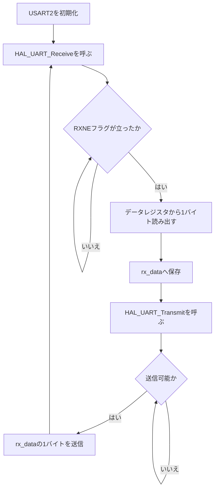

# uart00_polling

STM32 NUCLEO-F401REのUSART2をポーリング方式で使用する、1バイト単位のUARTエコーバックサンプルです。

PCから1バイト受信すると、受信した同じ1バイトをPCへ送り返します。NUCLEO-F401REのオンボードST-LINKが提供するVirtual COM Portを使用します。

## UART設定

| 項目 | 設定 |
| --- | --- |
| UART | USART2 |
| TX / RX | PA2 / PA3 |
| ボーレート | 115200 bps |
| データ長 | 8ビット |
| パリティ | なし |
| ストップビット | 1ビット |
| フロー制御 | なし |

## mainの処理

`Core/Src/main.c`の無限ループでは、次の2つの処理を繰り返します。

```c
while (1)
{
    HAL_UART_Receive(&huart2, &rx_data, 1, HAL_MAX_DELAY);
    HAL_UART_Transmit(&huart2, &rx_data, 1, HAL_MAX_DELAY);
}
```

- `&huart2`: USART2のハンドル
- `&rx_data`: 受信データを保存する変数のアドレス
- `1`: 送受信するデータサイズ（1バイト）
- `HAL_MAX_DELAY`: 完了するまで実質無期限に待機

ここで扱う単位は厳密には「1文字」ではなく「1バイト」です。ASCII文字は通常1文字が1バイトですが、UTF-8の日本語などは1文字が複数バイトになります。

## ポーリングの流れ



### 1. 受信待ち

```c
HAL_UART_Receive(&huart2, &rx_data, 1, HAL_MAX_DELAY);
```

`HAL_UART_Receive()`は、内部で`UART_WaitOnFlagUntilTimeout()`を呼び出します。USART2の受信データレジスタにデータが入るまで、`RXNE`（Receive Data Register Not Empty）フラグを繰り返し確認します。

概念的には次のような処理です。

```c
while (RXNEフラグが立っていない)
{
    // フラグを繰り返し確認する
}
```

今回はタイムアウトに`HAL_MAX_DELAY`を指定しているため、1バイト受信するまで`HAL_UART_Receive()`から戻りません。その間、`main()`は次の処理へ進めません。

### 2. 受信データの読み出し

PCから1バイト届くと、USARTハードウェアが`RXNE`フラグを立てます。HALはデータレジスタを読み出し、その値を`rx_data`へ保存して`HAL_UART_Receive()`から戻ります。

### 3. エコーバック送信

```c
HAL_UART_Transmit(&huart2, &rx_data, 1, HAL_MAX_DELAY);
```

HALは送信可能になるまでUARTのフラグをポーリングし、`rx_data`に保存された1バイトを送信します。送信が完了すると関数から戻ります。

### 4. 次の受信へ戻る

`while (1)`の先頭へ戻り、再び`HAL_UART_Receive()`で次の1バイトを待ちます。

```text
1バイト受信待ち
    ↓
1バイト受信
    ↓
同じ1バイトを送信
    ↓
次の1バイト受信待ち
```

## ポーリング方式の特徴

- 処理の流れが単純で理解しやすい
- 割り込み処理やコールバックが不要
- 受信待ちの間、CPUはUARTフラグの確認に使われる
- ブロック中は`main()`でほかの処理を実行できない

次の`uart01_irq`では割り込み受信を使用し、受信待ちの間にも`main()`でほかの処理を実行できる構成と比較します。

## ビルドとボード操作

```bash
./build.sh all      # Debugビルド（引数を省略してもall）
./build.sh clean    # ビルド生成物を削除
./build.sh flash    # ビルド後、Flashへ書き込み
./build.sh halt     # MCUを停止
./build.sh run      # 再書き込みせず、リセットして実行
./build.sh resume   # 停止した位置から実行を再開
./build.sh help     # 使用方法を表示
```

## シリアル確認

NUCLEO-F401REをUSB接続し、Virtual COM Portを確認します。

```bash
ls /dev/ttyACM*
```

ポートが`/dev/ttyACM0`の場合は、次のようにminicomを起動します。

```bash
minicom -D /dev/ttyACM0 -b 115200
```

入力したASCII文字と同じ文字が返れば、エコーバックは正常です。

## デバッガで確認するポイント

1. `HAL_UART_Receive()`をステップインする
2. `UART_WaitOnFlagUntilTimeout()`へ進む
3. `RXNE`フラグを確認するループで待機していることを確認する
4. minicomから1文字入力する
5. 待機ループを抜け、`rx_data`に値が入ることを確認する
6. `HAL_UART_Transmit()`で同じ値が送信されることを確認する
