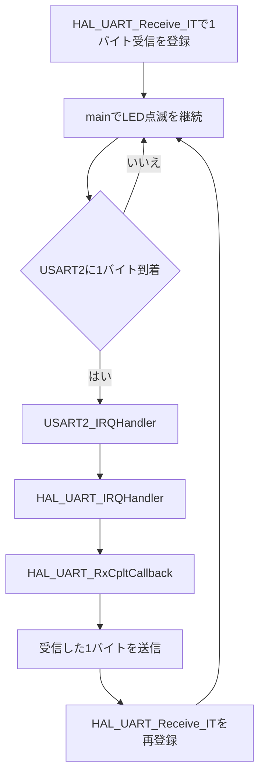

# uart01_irq

STM32 NUCLEO-F401REのUSART2を割り込み方式で受信する、1バイト単位のUARTエコーバックサンプルです。

`uart00_polling`では受信するまで`HAL_UART_Receive()`の内部で待ち続けました。このプロジェクトでは`HAL_UART_Receive_IT()`を使うため、受信待ちの間も`main()`は別の処理を続けられます。その確認用として、メインループでオンボードLED（LD2）を500 msごとに反転させます。

## UART設定

| 項目 | 設定 |
| --- | --- |
| UART | USART2 |
| TX / RX | PA2 / PA3 |
| ボーレート | 115200 bps |
| データ形式 | 8N1、フロー制御なし |
| 受信方式 | 割り込み |
| NVIC優先度 | 0 |

## 初回の受信登録

周辺機能を初期化した後、最初の1バイトを受信するための割り込み処理を登録します。

```c
if (HAL_UART_Receive_IT(&huart2, &rx_data, 1) != HAL_OK)
{
    Error_Handler();
}
```

この関数は受信完了を待たず、割り込みを有効にしてすぐに戻ります。

## 割り込み受信の流れ



### 1. USART2割り込み

データを受信するとUSART2割り込みが発生し、`Core/Src/stm32f4xx_it.c`のハンドラが呼ばれます。

```c
void USART2_IRQHandler(void)
{
    HAL_UART_IRQHandler(&huart2);
}
```

### 2. HALの受信完了処理

`HAL_UART_IRQHandler()`が受信データを`rx_data`へ格納します。指定した1バイトの受信が完了すると、HALが`HAL_UART_RxCpltCallback()`を呼び出します。

### 3. エコーバックと次回受信

```c
void HAL_UART_RxCpltCallback(UART_HandleTypeDef *huart)
{
    if (huart->Instance == USART2)
    {
        HAL_UART_Transmit(&huart2, &rx_data, 1, HAL_MAX_DELAY);
        HAL_UART_Receive_IT(&huart2, &rx_data, 1);
    }
}
```

受信完了コールバックで同じ1バイトを送信し、最後に`HAL_UART_Receive_IT()`をもう一度呼びます。再登録しない場合、次のデータを受信できません。

このサンプルでは流れを分かりやすくするため、コールバック内の送信にブロッキング版`HAL_UART_Transmit()`を使っています。実際のアプリケーションでは、割り込み処理を短く保つために送信割り込みやリングバッファを使う設計も検討します。

## mainの処理

```c
while (1)
{
    HAL_GPIO_TogglePin(LD2_GPIO_Port, LD2_Pin);
    HAL_Delay(500);
}
```

UARTデータが届いていない間もメインループは止まらず、LD2の点滅を続けます。これがポーリング版との重要な違いです。

## ビルドと書き込み

```bash
./build.sh all
./build.sh flash
```

そのほかの操作は`./build.sh help`で確認できます。

## シリアル確認

```bash
minicom -D /dev/ttyACM0 -b 115200
```

次の2点を同時に確認します。

- 入力したASCII文字と同じ文字が返る
- UART入力を待っている間もLD2が点滅し続ける

## デバッガで確認するポイント

1. 初回の`HAL_UART_Receive_IT()`がすぐに戻ること
2. UART受信待ちの間も`while (1)`が動作していること
3. 受信時に`USART2_IRQHandler()`が呼ばれること
4. 続いて`HAL_UART_RxCpltCallback()`が呼ばれること
5. コールバックの最後で次回受信を再登録していること
