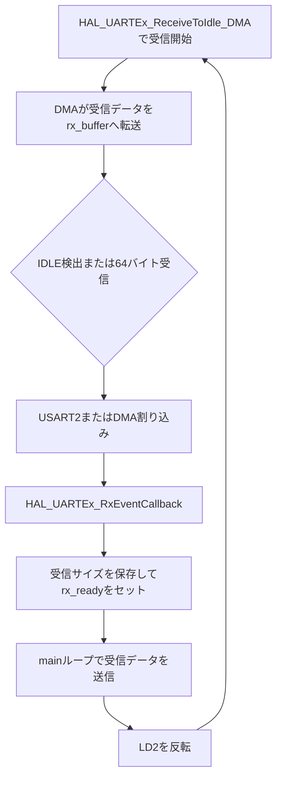

# uart03_dma_idle

STM32 NUCLEO-F401REのUSART2で、DMAとIDLE検出を使用して可変長データを受信するUARTエコーバックサンプルです。

`uart01_irq`は1バイトごとに受信割り込みを発生させます。このプロジェクトでは受信した各バイトをDMAがメモリへ転送し、通信が一旦途切れてIDLE状態になるか、64バイトの受信バッファが満杯になった時点でプログラムへ通知します。

## UARTとDMAの設定

| 項目 | 設定 |
| --- | --- |
| UART | USART2 |
| TX / RX | PA2 / PA3 |
| ボーレート | 115200 bps |
| データ形式 | 8N1、フロー制御なし |
| 受信方式 | DMA + IDLE検出 |
| DMA | DMA1 Stream5 / Channel 4 |
| DMAモード | Normal |
| 受信バッファ | 64バイト |

USART2はNUCLEO-F401REのST-LINK Virtual COM Portに接続されています。

## DMA受信の開始

初期化後に次の関数を呼び、最大64バイトのDMA受信を開始します。

```c
HAL_UARTEx_ReceiveToIdle_DMA(&huart2, rx_buffer, RX_BUFFER_SIZE);
```

この関数は受信完了を待たず、DMAを開始してすぐに戻ります。DMAはUSART2の受信データレジスタから`rx_buffer`へデータを転送します。

このサンプルではDMAのHalf Transfer割り込みを無効にしています。

```c
__HAL_DMA_DISABLE_IT(huart2.hdmarx, DMA_IT_HT);
```

そのため、受信イベントは主に次のどちらかで発生します。

- データの到着が一旦途切れ、USART2がIDLE状態になった
- 64バイトの受信バッファが満杯になった

## DMA + IDLE受信の流れ



### IDLEを検出した場合

USART2のIDLE割り込みから次の順に処理されます。

```text
USART2_IRQHandler()
  → HAL_UART_IRQHandler()
  → HAL_UARTEx_RxEventCallback()
```

### バッファが満杯になった場合

DMA転送完了割り込みから次の順に処理されます。

```text
DMA1_Stream5_IRQHandler()
  → HAL_DMA_IRQHandler()
  → UART HAL内部処理
  → HAL_UARTEx_RxEventCallback()
```

どちらの場合も、コールバックの`Size`には今回受信したバイト数が渡されます。

```c
void HAL_UARTEx_RxEventCallback(UART_HandleTypeDef *huart, uint16_t Size)
{
    if (huart->Instance == USART2)
    {
        rx_length = Size;
        rx_ready = 1U;
    }
}
```

コールバック内では時間のかかる送信をせず、受信サイズと処理要求だけを保存します。メインループがデータを送信し、次のDMA受信を再登録します。

## mainループ

`main_loop_count`をインクリメントし続けるため、デバッガで値を確認すると、DMA受信待ちの間もCPUがメイン処理を続けていることが分かります。

受信イベントが発生すると、メインループは次の処理を行います。

1. `rx_buffer`の受信済みデータをUSART2へ送信
2. オンボードLED（LD2）を反転
3. `HAL_UARTEx_ReceiveToIdle_DMA()`で次の受信を開始

## ビルドと書き込み

```bash
./build.sh all
./build.sh flash
```

そのほかの操作は次のコマンドで確認できます。

```bash
./build.sh help
```

## シリアル確認

```bash
minicom -D /dev/ttyACM0 -b 115200
```

文字列を入力または貼り付け、同じ内容が返ることを確認します。入力の区切りを検出するたびにLD2が反転します。

## デバッガで確認するポイント

1. `HAL_UARTEx_ReceiveToIdle_DMA()`が待たずに戻ること
2. 受信中にDMA1 Stream5のNDTR（残り転送数）が減ること
3. 短い文字列ではUSART2のIDLE割り込みが発生すること
4. `HAL_UARTEx_RxEventCallback()`の`Size`が受信文字数になること
5. `main_loop_count`が受信待ちの間も増え続けること
6. エコーバック後に次のDMA受信が再登録されること

## 学習用実装について

DMAは受信処理に使用し、送信には流れを追いやすいブロッキング版`HAL_UART_Transmit()`を使用しています。より実用的な構成では、送信側もDMA化したり、複数バッファやリングバッファを使って受信停止時間を短くしたりします。
