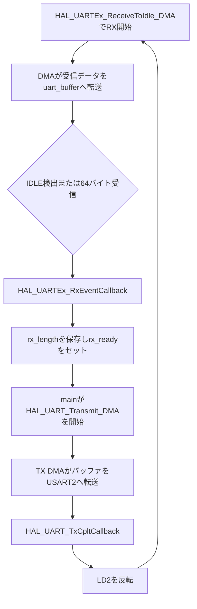

# uart04_dma_tx_rx

STM32 NUCLEO-F401REのUSART2で、受信と送信の両方にDMAを使用する可変長UARTエコーバックサンプルです。

`uart03_dma_idle`では受信だけをDMA化し、送信にはブロッキング版の`HAL_UART_Transmit()`を使用しました。このプロジェクトでは送信にも`HAL_UART_Transmit_DMA()`を使い、送信完了をコールバックで受け取ります。

## UARTとDMAの設定

| 項目 | 設定 |
| --- | --- |
| UART | USART2 |
| TX / RX | PA2 / PA3 |
| ボーレート | 115200 bps |
| データ形式 | 8N1、フロー制御なし |
| RX DMA | DMA1 Stream5 / Channel 4 |
| TX DMA | DMA1 Stream6 / Channel 4 |
| DMAモード | Normal |
| バッファ | 64バイト |

USART2はNUCLEO-F401REのST-LINK Virtual COM Portに接続されています。

## RX/TX DMAの流れ



## 受信DMA

起動時に可変長受信を開始します。

```c
HAL_UARTEx_ReceiveToIdle_DMA(&huart2, uart_buffer, UART_BUFFER_SIZE);
```

受信データはCPUが1バイトずつ読み出すのではなく、RX DMAが`uart_buffer`へ転送します。IDLE状態またはバッファ満杯を検出すると、HALが受信イベントコールバックを呼びます。

```c
void HAL_UARTEx_RxEventCallback(UART_HandleTypeDef *huart, uint16_t Size)
{
    if (huart->Instance == USART2)
    {
        rx_length = Size;
        rx_ready = 1U;
    }
}
```

## 送信DMA

メインループは`rx_ready`を確認し、受信したバイト数だけ送信DMAを開始します。

```c
HAL_UART_Transmit_DMA(&huart2, uart_buffer, rx_length);
```

`HAL_UART_Transmit_DMA()`は送信完了を待たず、DMAを開始してすぐに戻ります。この時点では送信が終わっていないため、`uart_buffer`を書き換えてはいけません。

## 送信完了

DMAとUSART2による送信が完了すると、HALが送信完了コールバックを呼びます。

```c
void HAL_UART_TxCpltCallback(UART_HandleTypeDef *huart)
{
    if (huart->Instance == USART2)
    {
        tx_busy = 0U;
        HAL_GPIO_TogglePin(LD2_GPIO_Port, LD2_Pin);
        UART_StartReceiveToIdleDMA();
    }
}
```

このコールバックで共有バッファが再利用可能になったことを確認し、次のRX DMAを開始します。

## 割り込みの経路

受信IDLE検出ではUSART2割り込みが使われます。

```text
USART2_IRQHandler()
  → HAL_UART_IRQHandler()
  → HAL_UARTEx_RxEventCallback()
```

送信DMAの転送完了では、まずDMA1 Stream6割り込みが発生します。その後、USART2の送信完了を経てコールバックが呼ばれます。

```text
DMA1_Stream6_IRQHandler()
  → HAL_DMA_IRQHandler()
  → USART2_IRQHandler()
  → HAL_UART_IRQHandler()
  → HAL_UART_TxCpltCallback()
```

## 1バッファ構成の制限

このサンプルはRXとTXで同じ`uart_buffer`を使用します。送信DMAが読み出している途中で受信DMAが同じメモリを書き換えないよう、送信完了後に次の受信を開始します。

したがって、送信中にPCから次のデータが到着すると取りこぼす可能性があります。これは送信DMAの基本動作を分かりやすく確認するための構成です。連続通信では、RX用とTX用の別バッファ、ダブルバッファ、またはリングバッファを使用します。

## ビルドと書き込み

```bash
./build.sh all
./build.sh flash
```

そのほかの操作は次で確認できます。

```bash
./build.sh help
```

## シリアル確認

```bash
minicom -D /dev/ttyACM0 -b 115200
```

文字列を入力または貼り付け、同じ内容が返ることを確認します。送信完了ごとにLD2が反転します。

## デバッガで確認するポイント

1. `HAL_UARTEx_ReceiveToIdle_DMA()`が待たずに戻ること
2. `HAL_UARTEx_RxEventCallback()`の`Size`が受信文字数になること
3. `HAL_UART_Transmit_DMA()`が送信完了前に戻ること
4. 送信中は`tx_busy`が1になること
5. `DMA1_Stream6_IRQHandler()`が呼ばれること
6. `HAL_UART_TxCpltCallback()`で`tx_busy`が0になること
7. 送信完了後に次のRX DMAが開始されること
