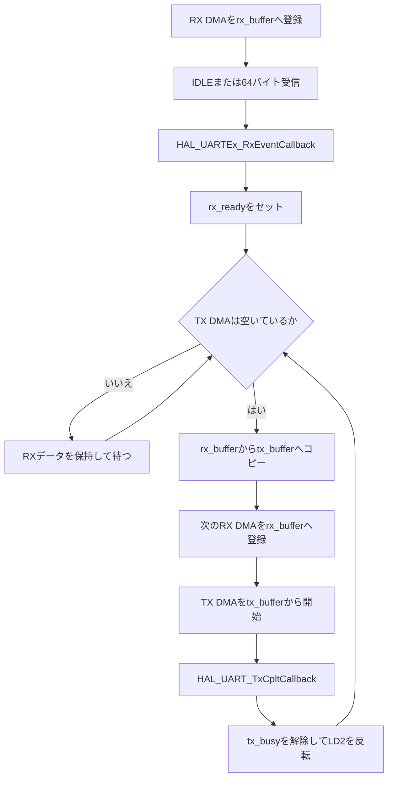

# uart05_dma_double_buffer

STM32 NUCLEO-F401REのUSART2で、RX用とTX用のバッファを分離して受信DMAと送信DMAを同時に動かすUARTエコーバックサンプルです。

`uart04_dma_tx_rx`ではRXとTXが同じバッファを使用するため、送信完了まで次の受信を開始できませんでした。このプロジェクトでは、受信データをRXバッファからTXバッファへコピーし、送信中も次の受信を続けられるようにします。

## UARTとDMAの設定

| 項目 | 設定 |
| --- | --- |
| UART | USART2 |
| TX / RX | PA2 / PA3 |
| ボーレート | 115200 bps |
| データ形式 | 8N1、フロー制御なし |
| RX DMA | DMA1 Stream5 / Channel 4 |
| TX DMA | DMA1 Stream6 / Channel 4 |
| DMAモード | Normal |
| RXバッファ | 64バイト |
| TXバッファ | 64バイト |

## 2つのバッファ

```c
static uint8_t rx_buffer[UART_BUFFER_SIZE];
static uint8_t tx_buffer[UART_BUFFER_SIZE];
```

DMAごとの役割を分離しています。

```text
RX DMA: USART2 → rx_buffer
TX DMA: tx_buffer → USART2
```

TX DMAが`tx_buffer`を読み出している間も、RX DMAは別の`rx_buffer`へ書き込めます。

## 処理の流れ



## 受信イベント

IDLEまたはバッファ満杯で、HALが受信イベントコールバックを呼びます。

```c
void HAL_UARTEx_RxEventCallback(UART_HandleTypeDef *huart, uint16_t Size)
{
    if (huart->Instance == USART2)
    {
        rx_length = Size;
        rx_ready = 1U;
    }
}
```

コールバックでは受信サイズと処理要求だけを保存し、コピーや送信はmainループで行います。

## コピーとRX再開

TX DMAが空いている場合、mainループは受信データをTX専用バッファへコピーします。

```c
memcpy(tx_buffer, rx_buffer, length);
```

コピー後の`tx_buffer`はTX DMAだけが使用します。そのため、同じ内容を送信している間に`rx_buffer`を次の受信へ再利用できます。

```c
UART_StartReceiveToIdleDMA();
HAL_UART_Transmit_DMA(&huart2, tx_buffer, length);
```

今回の重要な点は、TX DMA完了を待たずに次のRX DMAを開始していることです。

## 送信完了

```c
void HAL_UART_TxCpltCallback(UART_HandleTypeDef *huart)
{
    if (huart->Instance == USART2)
    {
        tx_busy = 0U;
        HAL_GPIO_TogglePin(LD2_GPIO_Port, LD2_Pin);
    }
}
```

RX DMAはすでに再開しているため、送信完了コールバックでは次の受信登録を行いません。送信中フラグの解除とLED反転だけを行います。

## uart04との違い

| 項目 | uart04 | uart05 |
| --- | --- | --- |
| RX/TXバッファ | 共通 | 分離 |
| RX再開 | TX完了後 | コピー直後 |
| TX中の受信 | 不可 | 可能 |
| データコピー | なし | `memcpy()`あり |

## この構成の制限

TX DMAが動作中でも、次の1回分はRXバッファへ受信できます。ただし、その受信が完了するとRX DMAは停止し、TX DMAが空くまで待ちます。

複数の受信データを待ち行列として保持することはできません。連続して多数のデータを処理するには、リングバッファや複数の送信キューが必要です。

## ビルドと書き込み

```bash
./build.sh all
./build.sh flash
```

そのほかの操作は次で確認できます。

```bash
./build.sh help
```

## シリアル確認

```bash
minicom -D /dev/ttyACM0 -b 115200
```

文字列を入力または貼り付け、同じ内容が返ることを確認します。TX DMA完了ごとにLD2が反転します。

## デバッガで確認するポイント

1. IDLE検出後に`rx_ready`が1になること
2. `memcpy()`後に`rx_buffer`と`tx_buffer`の内容が一致すること
3. TX DMA開始後もRX DMAが有効になっていること
4. 送信中は`tx_busy`が1になること
5. TX DMAが`tx_buffer`を使用していること
6. RX DMAが`rx_buffer`を使用していること
7. `HAL_UART_TxCpltCallback()`で`tx_busy`が0になること
